<div align="center">
  <h1>🎬 Video Action Recognition</h1>
  <p><strong>State-of-the-art action recognition powered by LS-ViT</strong></p>

  <p>
    <a href="#key-features">Features</a> •
    <a href="#getting-started">Getting Started</a> •
    <a href="#architecture">Architecture</a> •
    <a href="#usage">Usage</a> •
    <a href="#contributing">Contributing</a>
  </p>

  
  
  
  
</div>

---

## 📖 Introduction

**Video Action Recognition** is a production-ready deep learning system that accurately identifies human actions in video sequences. Built on the cutting-edge **LS-ViT (Long Short-term Vision Transformer)** architecture, this project combines spatial and temporal video analysis with transformer-based attention mechanisms to achieve robust action recognition across 51 action categories from the HMDB51 dataset.

The system leverages the power of Vision Transformers (ViT) with specialized modules for motion-informed feature integration (SMIF) and long-term motion interaction (LMI), enabling nuanced understanding of both short-term dynamics and long-range temporal dependencies in video data.

### 🎯 What Makes This Project Special?

- **Universal Device Support**: Seamlessly runs on NVIDIA GPUs (CUDA), Apple Silicon (MPS), and CPU
- **Modern MLOps Standards**: Clean, modular architecture designed for production environments
- **Environment-Driven Configuration**: Flexible setup through environment variables for CI/CD integration
- **Research-to-Production Ready**: Implements state-of-the-art research with production-grade code quality

---

## ✨ Key Features

### 🏗️ Architecture & Model

- **LS-ViT Architecture**: Advanced video transformer with motion-aware feature processing
- **SMIF Module**: Short-term Motion-Informed Feature integration for capturing immediate dynamics
- **LMI Module**: Long-term Motion Interaction for understanding extended temporal patterns
- **Pre-trained Backbone**: Leverages ImageNet pre-trained ViT weights for transfer learning

### 🚀 Performance & Optimization

- **Multi-Device Support**: Automatic device selection (CUDA → MPS → CPU)
- **Mixed-Precision Training**: AMP (Automatic Mixed Precision) for faster training
- **Gradient Accumulation**: Memory-efficient training for larger effective batch sizes
- **Smart Data Loading**: Optimized video frame sampling with configurable stride

### 🛠️ Developer Experience

- **Modular Codebase**: Clean separation of concerns (config, data, model, training, inference)
- **Environment-Based Config**: All hyperparameters configurable via environment variables
- **Automated Data Setup**: One-command dataset download and preparation
- **Comprehensive CLI**: Rich command-line interface for training and inference
- **Type Hints & Documentation**: Fully typed codebase for better IDE support

### 📊 Training & Evaluation

- **Automatic Checkpointing**: Saves best model based on validation accuracy
- **Progress Tracking**: Real-time training metrics with tqdm progress bars
- **Train/Val Split**: Intelligent video-level splitting to prevent data leakage
- **Reproducible Results**: Seed-based deterministic training

---

## 🏛️ Architecture

### System Overview

```mermaid
graph TB
    subgraph "Data Pipeline"
        A[HMDB51 Dataset<br/>51 Action Classes] --> B[Video Frame Loader]
        B --> C[Temporal Sampling<br/>16 frames @ stride 2]
        C --> D[Video Transforms<br/>Augmentation & Normalization]
    end

    subgraph "LS-ViT Model"
        D --> E[Patch Embedding<br/>224x224 → 196 patches]
        E --> F[ViT Backbone<br/>12 Transformer Layers]
        F --> G[SMIF Module<br/>Short-term Motion]
        G --> H[LMI Module<br/>Long-term Dependencies]
        H --> I[Classification Head<br/>51 Classes]
    end

    subgraph "Training Loop"
        I --> J[Cross-Entropy Loss]
        J --> K[Adam Optimizer]
        K --> L{Validation<br/>Accuracy}
        L -->|Best| M[Save Checkpoint]
        L -->|Continue| K
    end

    subgraph "Inference"
        N[Test Video] --> O[Preprocessing]
        O --> E
        I --> P[Predicted Action]
    end

    style A fill:#e1f5ff
    style I fill:#ffe1e1
    style M fill:#e1ffe1
    style P fill:#fff3e1
```



### Model Components

```mermaid
graph LR
    A[Input Video<br/>T×H×W×C] --> B[Frame Extraction<br/>16 frames]
    B --> C[Patch Embedding]
    C --> D[ViT Encoder<br/>12 Layers]

    D --> E[SMIF Module]
    E --> E1[Motion Detection<br/>Frame Differences]
    E1 --> E2[Adaptive Feature Fusion]

    E2 --> F[LMI Module]
    F --> F1[Temporal Attention]
    F1 --> F2[Long-range Dependencies]

    F2 --> G[Global Pooling]
    G --> H[Classification Head]
    H --> I[Action Prediction<br/>51 Classes]

    style A fill:#e1f5ff
    style E fill:#ffe1f5
    style F fill:#f5e1ff
    style I fill:#fff3e1
```



**Key Architecture Details:**

- **Patch Embedding**: Converts 224×224 images into 196 fixed-size patches (16×16)
- **ViT Backbone**: 12-layer transformer with 768-dimensional embeddings and 12 attention heads
- **SMIF (Short-term Motion-Informed Features)**:
  - Computes frame-to-frame differences within a temporal window (default: 5 frames)
  - Applies motion-aware feature weighting to emphasize dynamic regions
  - Adaptive fusion controlled by learnable parameter α
- **LMI (Long-term Motion Interaction)**:
  - Cross-frame attention mechanism for capturing long-range temporal patterns
  - Processes entire video sequence to model action progression
- **Classification Head**: Simple linear projection to 51 action classes

---

## 🚀 Getting Started

### Prerequisites

- **Python**: 3.12 or higher
- **PyTorch**: 2.10.0 or higher
- **Hardware**:
  - NVIDIA GPU with CUDA support (recommended)
  - Apple Silicon (M1/M2/M3/M4) with MPS
  - CPU (slower, not recommended for training)
- **Storage**: ~3GB for dataset, ~500MB for model weights
- **Internet**: Required for initial dataset and weights download

### Installation

#### Option 1: Using uv (Recommended)

[uv](https://github.com/astral-sh/uv) is a fast Python package installer and resolver written in Rust.

```bash
# Install uv if you haven't already
curl -LsSf https://astral.sh/uv/install.sh | sh

# Clone the repository
git clone https://github.com/yourusername/video-action-recognition.git
cd video-action-recognition

# uv will automatically create a virtual environment and install dependencies
uv run python --version
```

#### Option 2: Using pip

```bash
# Clone the repository
git clone https://github.com/yourusername/video-action-recognition.git
cd video-action-recognition

# Create virtual environment
python -m venv venv

# Activate virtual environment
# On Windows:
venv\Scripts\activate
# On macOS/Linux:
source venv/bin/activate

# Install dependencies
pip install -e .
```

#### Option 3: Development Installation

```bash
# Clone with development dependencies
git clone https://github.com/yourusername/video-action-recognition.git
cd video-action-recognition

# Install in editable mode
pip install -e ".[dev]"
```

---

## 📦 Data Preparation

The project uses the **HMDB51** dataset, which contains 6,766 video clips divided into 51 action categories including:

- **Body movements**: walk, run, jump, climb, sit, stand
- **Body-object interaction**: brush_hair, catch, draw_sword, drink, eat, pour
- **Human interaction**: hug, kiss, shake_hands, talk
- **Sports actions**: golf, shoot_ball, ride_bike, swing_baseball

### Automatic Download

Run the automated download script to fetch and prepare the dataset:

```bash
python download_data.py
```

**What this script does:**

1. Downloads HMDB51 dataset (~2.3GB) from Google Drive
2. Extracts to `data/raw/HMDB51/`
3. Organizes into class-based folder structure
4. Validates the directory structure
5. Cleans up temporary files

**Expected structure after download:**

```
data/raw/HMDB51/
├── brush_hair/
│   ├── video_001/
│   │   ├── frame_00001.jpg
│   │   ├── frame_00002.jpg
│   │   └── ...
│   └── video_002/
├── cartwheel/
├── catch/
└── ... (51 action classes total)
```

### Manual Download

If automatic download fails, manually download the dataset from [HMDB51 official site](https://serre-lab.clps.brown.edu/resource/hmdb-a-large-human-motion-database/) and place it in `data/raw/HMDB51/`.

---

## 🎯 Usage

### Training

#### Basic Training

Start training with default configuration:

```bash
# Using uv
uv run python scripts/train.py

# Using regular Python
python scripts/train.py
```

**Training process:**

1. Initializes LS-ViT model with random weights
2. Downloads ImageNet pre-trained ViT backbone (first run only)
3. Loads and preprocesses HMDB51 dataset
4. Splits data into train (90%) and validation (10%) sets
5. Trains for specified epochs with automatic checkpointing
6. Evaluates on validation set after each epoch
7. Saves best model to `checkpoints/best_model.pth`

**Expected output:**

```
Using device: cuda
Initializing datasets...
Loading pretrained weights: vit_base_patch16_224
Found 6090 videos for training, 676 for validation
Starting training...

Epoch 1/10
Train: 100%|████████| 762/762 [12:34<00:00, loss=2.8456, acc=0.3421]
Val:   100%|████████| 85/85 [01:23<00:00]
Validation Accuracy: 0.4123
✓ New best model saved!

Epoch 2/10
...
```

#### Training with Custom Parameters

Override defaults using command-line arguments:

```bash
python scripts/train.py \
  --epochs 20 \
  --batch_size 16 \
  --lr 0.0001 \
  --num_frames 16 \
  --frame_stride 2 \
  --num_workers 4 \
  --val_ratio 0.15
```

**Available arguments:**

| Argument           | Type  | Default             | Description                   |
| ------------------ | ----- | ------------------- | ----------------------------- |
| `--epochs`         | int   | 10                  | Number of training epochs     |
| `--batch_size`     | int   | 8                   | Videos per batch              |
| `--lr`             | float | 1e-4                | Learning rate                 |
| `--data_root`      | str   | `./data/raw/HMDB51` | Dataset directory             |
| `--num_frames`     | int   | 16                  | Frames sampled per video      |
| `--frame_stride`   | int   | 2                   | Stride between sampled frames |
| `--num_workers`    | int   | 4                   | Data loading workers          |
| `--val_ratio`      | float | 0.1                 | Validation split ratio        |
| `--seed`           | int   | 42                  | Random seed                   |
| `--checkpoint_dir` | str   | `./checkpoints`     | Checkpoint save location      |

### Inference

Run inference on test videos or the test split:

```bash
python scripts/inference.py \
  --checkpoint ./checkpoints/best_model.pth \
  --data_root ./data/test \
  --output ./submission.csv
```

**Inference arguments:**

| Argument       | Type | Default          | Description             |
| -------------- | ---- | ---------------- | ----------------------- |
| `--checkpoint` | str  | Required         | Path to trained model   |
| `--data_root`  | str  | Required         | Test data directory     |
| `--output`     | str  | `submission.csv` | Output predictions file |
| `--batch_size` | int  | 8                | Inference batch size    |

**Output format:**

```csv
id,class
0,brush_hair
1,cartwheel
2,catch
...
```

---

## ⚙️ Configuration

### Environment Variables

All configuration parameters can be overridden using environment variables for flexible deployment:

#### Model Configuration

| Variable                 | Type | Default | Description          |
| ------------------------ | ---- | ------- | -------------------- |
| `APPCONFIG__IMAGE_SIZE`  | int  | 224     | Input image size     |
| `APPCONFIG__PATCH_SIZE`  | int  | 16      | Patch dimensions     |
| `APPCONFIG__EMBED_DIM`   | int  | 768     | Embedding dimension  |
| `APPCONFIG__DEPTH`       | int  | 12      | Transformer layers   |
| `APPCONFIG__NUM_HEADS`   | int  | 12      | Attention heads      |
| `APPCONFIG__NUM_CLASSES` | int  | 51      | Action classes       |
| `APPCONFIG__SMIF_WINDOW` | int  | 5       | Temporal window size |

#### Training Configuration

| Variable                  | Type  | Default | Description           |
| ------------------------- | ----- | ------- | --------------------- |
| `APPCONFIG__BATCH_SIZE`   | int   | 8       | Batch size            |
| `APPCONFIG__NUM_FRAMES`   | int   | 16      | Frames per video      |
| `APPCONFIG__FRAME_STRIDE` | int   | 2       | Frame sampling stride |
| `APPCONFIG__LR`           | float | 1e-4    | Learning rate         |
| `APPCONFIG__EPOCHS`       | int   | 10      | Training epochs       |
| `APPCONFIG__NUM_WORKERS`  | int   | 4       | Data loader workers   |

#### Usage Examples

**Windows (PowerShell):**

```powershell
$env:APPCONFIG__BATCH_SIZE="16"
$env:APPCONFIG__EPOCHS="20"
uv run python scripts/train.py
```

**macOS/Linux:**

```bash
export APPCONFIG__BATCH_SIZE=16
export APPCONFIG__EPOCHS=20
python scripts/train.py
```

**Inline:**

```bash
APPCONFIG__BATCH_SIZE=16 APPCONFIG__LR=0.0001 python scripts/train.py
```

### Device-Specific Recommendations

#### Apple Silicon (M1/M2/M3/M4)

```bash
# Optimal settings for MacBooks
export APPCONFIG__BATCH_SIZE=4
export APPCONFIG__NUM_WORKERS=2
python scripts/train.py
```

**Notes:**

- Unified memory architecture shares RAM between CPU and GPU
- Lower batch sizes (4-8) prevent memory issues
- Fewer workers (0-2) avoid file descriptor limits
- MPS backend automatically used when available

#### NVIDIA GPUs

```bash
# Recommended for RTX 3080/4080 (10-16GB VRAM)
export APPCONFIG__BATCH_SIZE=16
export APPCONFIG__NUM_WORKERS=8
python scripts/train.py
```

#### CPU Only

```bash
# CPU training (not recommended, very slow)
export APPCONFIG__BATCH_SIZE=2
export APPCONFIG__NUM_WORKERS=4
python scripts/train.py
```

---

## 📁 Project Structure

```
video-action-recognition/
│
├── 📄 pyproject.toml              # Project metadata and dependencies (uv/pip)
├── 📄 LICENSE                     # MIT License
├── 📄 README.md                   # This file
├── 📄 download_data.py            # Automated dataset download script
│
├── 📂 src/                        # Core source code
│   ├── __init__.py               # Package initialization
│   ├── config.py                 # Configuration dataclasses (Model & Training)
│   ├── dataset.py                # HMDB51 dataset loader and transforms
│   ├── model.py                  # LS-ViT architecture implementation
│   ├── engine.py                 # Training and evaluation loops
│   └── utils.py                  # Utility functions (seeding, checkpointing)
│
├── 📂 scripts/                    # Executable scripts
│   ├── train.py                  # Main training entry point
│   └── inference.py              # Inference and submission generation
│
├── 📂 data/                       # Data directory (gitignored)
│   └── raw/
│       └── HMDB51/               # Downloaded dataset
│           ├── brush_hair/
│           ├── cartwheel/
│           ├── catch/
│           └── ... (51 classes)
│
├── 📂 checkpoints/                # Model checkpoints (gitignored)
│   └── best_model.pth            # Best validation accuracy model
│
├── 📂 weights/                    # Pre-trained weights
│   └── vit_base_patch16_224_timm.pth
│
└── 📂 notebooks/                  # Jupyter notebooks for experimentation
```

### Key Modules

#### `src/config.py`

Defines configuration dataclasses with environment variable support:

- `ModelConfig`: Architecture hyperparameters (embed_dim, depth, num_heads, etc.)
- `TrainingConfig`: Training settings (batch_size, lr, epochs, device selection)

#### `src/dataset.py`

- `HMDB51Dataset`: PyTorch Dataset for HMDB51 with video-level train/val splitting
- `VideoTransform`: Data augmentation pipeline (resize, crop, flip, normalize)
- Smart frame sampling with configurable num_frames and stride
- Prevents data leakage by splitting at video level, not clip level

#### `src/model.py`

Complete LS-ViT implementation:

- `LSViTForAction`: Full model with backbone + SMIF + LMI + classifier
- `ViTBackbone`: Vision Transformer encoder with patch embedding
- `SMIFModule`: Short-term motion-informed feature integration
- `LMIModule`: Long-term motion interaction with temporal attention
- Pre-trained weight loading from timm models

#### `src/engine.py`

- `train_one_epoch()`: Training loop with AMP, gradient accumulation
- `evaluate()`: Validation loop with accuracy metrics
- Automatic device-specific optimization (CUDA/MPS/CPU)

#### `src/utils.py`

- `set_seed()`: Reproducible random seed setting
- `load_vit_checkpoint()`: Smart weight loading and mapping
- `ensure_dir()`: Directory creation utilities

---

## 🤝 Contribution Guidelines

Contributions are welcome! Please follow these steps:

1. **Fork** the project.
2. Create a **Feature Branch** (`git checkout -b feature/AmazingFeature`).
3. **Commit** your changes (`git commit -m 'Add AmazingFeature'`).
4. **Push** to the branch (`git push origin feature/AmazingFeature`).
5. Open a **Pull Request**.

---

## 📄 License

This project is licensed under the **MIT License** - see the [LICENSE](LICENSE) file for details.

---

## 🗺️ Roadmap

- **Near-term**: Multi-dataset support (UCF-101, Kinetics), advanced augmentations (MixUp, CutMix), experiment tracking (Wandb/TensorBoard), and Docker containerization
- **Mid-term**: Multi-GPU training with DDP, model compression and quantization, ONNX export, REST API deployment, and interactive web demos
- **Long-term**: Alternative architectures (Swin Transformer, VideoMAE), real-time edge inference, mobile deployment, hyperparameter optimization with AutoML
- **Vision**: Self-supervised pre-training, few-shot learning, temporal action detection, multi-modal fusion, and production-ready templates for real-world applications

---

## 🔧 Troubleshooting

### Common Issues

**1. Out of Memory Errors**

```bash
# Reduce batch size
export APPCONFIG__BATCH_SIZE=4
python scripts/train.py
```

**2. CUDA Out of Memory**

```python
# Add to train.py before training
torch.cuda.empty_cache()
```

**3. MPS Fallback to CPU**

```bash
# Check MPS availability
python -c "import torch; print(torch.backends.mps.is_available())"
```

**4. Slow Data Loading**

```bash
# Adjust workers
export APPCONFIG__NUM_WORKERS=0  # Try 0 first, then 2, 4, etc.
```

**5. Download Script Fails**

- Check internet connection
- Verify Google Drive link is not rate-limited
- Try manual download and extraction

---

## 🙏 Acknowledgments

- **HMDB51 Dataset**: Kuehne et al., "HMDB: A Large Video Database for Human Motion Recognition"
- **Vision Transformer**: Dosovitskiy et al., "An Image is Worth 16x16 Words: Transformers for Image Recognition at Scale"
- **timm Library**: Ross Wightman for excellent pre-trained model implementations
- **PyTorch Team**: For the outstanding deep learning framework

---

<div align="center">
  <p>If you find this project useful, please consider giving it a ⭐️!</p>
  <p>Made with ❤️ for the computer vision community</p>
</div>
